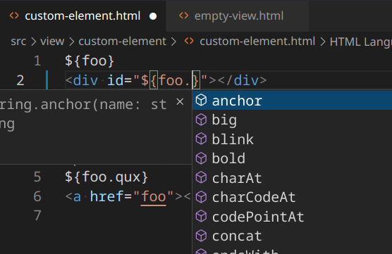
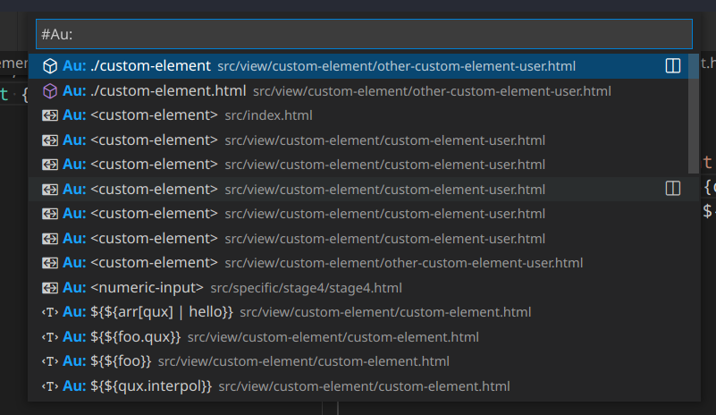

## [2.3.7](https://github.com/aurelia/vscode-extension/compare/2.3.6...2.3.7) (2022-12-26)


### Features

* **commands.extract:** let user choose name ([ecf01e8](https://github.com/aurelia/vscode-extension/commit/ecf01e867fd78164c8c9e748d0d82b6216a60a82))


### Bug Fixes
* **chore(server)**: fix connection when not testing
  * Aurelia did not show up in output


## [2.3.6](https://github.com/aurelia/vscode-extension/compare/2.3.5...2.3.6) (2022-12-25)


### Bug Fixes

* **commands.extract:** don't user decorators .. ([109b953](https://github.com/aurelia/vscode-extension/commit/109b9534cae51af86c85b9a83f04d4e76981ad0e))


### Features

* **aot:** add types to class member ([41baccd](https://github.com/aurelia/vscode-extension/commit/41baccd1b293174e3c9d203553ecb7bab2aea703))
* **aureliaVersion:** bindable package based on version ([db252f3](https://github.com/aurelia/vscode-extension/commit/db252f36484f961a9467f26fa840ed11c1fc49a9))
* **aureliaVersion:** parse and store to project ([19e31eb](https://github.com/aurelia/vscode-extension/commit/19e31eb7eb2a2a5bbf1b05d2acab212ad0cc1eb8))
* **commands.extract:** add types to viewModel bindables if present ([b5d2449](https://github.com/aurelia/vscode-extension/commit/b5d24498bb3cf118744c265d01b4c18080d4ca92))
* **commands.extract:** create view, prepare view model ([2b8a2d6](https://github.com/aurelia/vscode-extension/commit/2b8a2d638078d55197477ef38da6d302e6a41dbc))
* **commands.extract:** finish viewModel and replace with newly created tag ([333ee7b](https://github.com/aurelia/vscode-extension/commit/333ee7bf24d1772a998939652a3fbf5e303e0262))
* **commands.extract:** init input and files in server ([f9827cf](https://github.com/aurelia/vscode-extension/commit/f9827cf8ad6b2540fb2dfe06ca8af861e3fbd7f5))
* **commands.extract:** support user generated templates ([0ebf25a](https://github.com/aurelia/vscode-extension/commit/0ebf25a35c2681cf2c83bf8e583f7f7dc03a83fc))
* **common:** add check for au version ([0589298](https://github.com/aurelia/vscode-extension/commit/0589298910e05bb6317648a0dd6307a6dbfa04e3))


## [2.3.5](https://github.com/aurelia/vscode-extension/compare/2.3.4...2.3.5) (2022-10-05)


### Bug Fixes

* **core:** add "aurelia-bootstrapper" to v1 detection ([d09dfc3](https://github.com/aurelia/vscode-extension/commit/d09dfc337af70dd59740c8344ec424129578e299)), closes [#199](https://github.com/aurelia/vscode-extension/issues/199)


## [2.3.4](https://github.com/aurelia/vscode-extension/compare/2.3.3...2.3.4) (2022-04-10)


### Bug Fixes

* **documents:** Start up crash on certain projects.
  * check if file exists before ([3b08349](https://github.com/aurelia/vscode-extension/commit/3b083499a8b64ef307da1e850527a43c07cd9a4b))


## [2.3.3](https://github.com/aurelia/vscode-extension/compare/2.3.2...2.3.3) (2022-03-15)


### Bug Fixes

* **core:** Update a file should now correctly update the extension internal logic.
  * update uses correct paths to compare ([fab68cd](https://github.com/aurelia/vscode-extension/commit/fab68cd766aca4286f20c490c85f598597206196))


## [2.3.2](https://github.com/aurelia/vscode-extension/compare/2.3.1...2.3.2) (2022-03-13)

**Refactoring**
* new /aot directory
  * parsing
  * AureliaProgram (analyses components etc.)

## [2.3.1](https://github.com/aurelia/vscode-extension/compare/2.3.0...2.3.1) (2022-03-08)


### Bug Fixes

* **definition:** normalize variable names before checking eq ([638bef6](https://github.com/aurelia/vscode-extension/commit/638bef64933e1cf75406c0386c4c5b4bca20c112))
* **regions:** repeat.for location parsing ([0fe3eb4](https://github.com/aurelia/vscode-extension/commit/0fe3eb4664fa5f22bde61af5780dd7d83b60f376)), closes [#186](https://github.com/aurelia/vscode-extension/issues/186)
* **rename:** normalize variable names before checking eq ([b7ed03e](https://github.com/aurelia/vscode-extension/commit/b7ed03e9119f2020b69357a42dd30dcd11c72d90))


# [2.3.0](https://github.com/aurelia/vscode-extension/compare/2.1.4...2.3.0) (2022-02-06)

### Note on versioning
We are trying out VSCode pre-release https://code.visualstudio.com/api/working-with-extensions/publishing-extension.
In the hopes, that we can more freely push updates, and to monitor code changes, before an "official" release.

Example:
- 2.3.* for pre-release
- 2.4.* for release

### Bug Fixes

* **core:** use correct file format for document finding ([98cf4ca](https://github.com/aurelia/vscode-extension/commit/98cf4ca84a2c66cd43508c97322a480057727a00))
* **definitions:** add editing tracker ([56d1d1b](https://github.com/aurelia/vscode-extension/commit/56d1d1bee618be2aec13691171f2f0f5b7b83eb3))
* **rename:** add editing tracker ([1c4a65d](https://github.com/aurelia/vscode-extension/commit/1c4a65d5a60169b8012415b6a232f3ab7a64954d))

If you noticed, that normal Typescript Renaming and Definitions behaved off. Yes that was our mistake.
Explanation:
- To enrich your view model files with Aurelia specific features, we return (eg. View information) in the Defintions list as well
- But, when we return new information, the old Typescript Defintions are overwritten.
- So we used a library (TsMorph) to readd those missing Typescript Defintions.
- When doing so, the normal Typescript Defintions sometimes got outdated
  - Because we only accounted for *saved files* and not *files, that you are currently editing (eg. a dot instead of an x next the file name)*
- --> Fix: Try to always use files, that have the correct "real time" content
  - Detail: Introduce a `editingFilesTracker` array, that collects files while you are editing
    - Clears the tracker on save.


## [2.1.4](https://github.com/aurelia/vscode-extension/compare/2.1.3...2.1.4) (2021-12-29)

### Chore
- Don't ignore node_modules
  - (extension did not get picked up)

## [2.1.3](https://github.com/aurelia/vscode-extension/compare/2.1.2...2.1.3) (2021-12-29)

### Bug Fixes

- attempt to fix Extension not activating on Windows/Mac

## [2.1.2](https://github.com/aurelia/vscode-extension/compare/2.1.1...2.1.2) (2021-12-25)


### Bug Fixes

* **core:** determine Aurelia boolean not used ([df5412f](https://github.com/aurelia/vscode-extension/commit/df5412f6999f749c03240d6dcc1b8dea6eb77e9a))


## [2.1.1](https://github.com/aurelia/vscode-extension/compare/2.1.0...2.1.1) (2021-12-25)

### Fix
- Switch to npm back from yarn (fix "module not found")


## [2.1.0](https://github.com/aurelia/vscode-extension/compare/2.0.7...2.1.0) (2021-12-25)

Big new update. Visit the official repo https://github.com/aurelia/vscode-extension to find out more.
For a feature list go to https://github.com/aurelia/vscode-extension/tree/develop/docs/user

### Features
- Improved Completions
  - Added Javascript methods completions for Global objects (String, Number,...)
    <details>
      <summary>Completions example (expand)</summary>

      *(Provide method completions for Javascript String)*
      
    </details>

- Improved Definitions
  - Added capability to go find all references of a component
    <details>
      <summary>Defintions example (expand)</summary>

      *(Show all places where `<custom-element>` component is used)*
      
    </details>
- Improved Monorepo support
- Added Code Action
  - Turn `<a href="">` into `<import from="">` (convenience)
    - Why: In the absence of extension like [Path intellisense](https://github.com/ChristianKohler/PathIntellisense) one could leverage the completions capabilities of the a tag, then turn it into an `<import>` tag
- Added Editor Symbols
- Added Workspace Symbols
  <details>
    <summary>Symbols example (expand)</summary>

    *(Search for all Aurelia related information from your Views.)*
    
  </details>

### Unstable warning
Please note, that due to the low iteration count, all features may not be as stable as we like them to be. Before submitting and issue, check out the [Troubleshooting](https://github.com/aurelia/vscode-extension#troubleshooting) section
If you still haven't found a solution to your problem, you are more than welcome to [open an issue](https://github.com/aurelia/vscode-extension/issues/new).
The extension is in active use by the authors, so you can expect a swift response, but do note, that an actual fix cannot be guaranteed. Regardless, we are thankful, that you took the time to troubleshoot with us!


## [2.0.7](https://github.com/aurelia/vscode-extension/compare/2.0.6...2.0.7) (2021-08-14)

### Bug Fixes

* **completions:** add missing arg ([ab9045a](https://github.com/aurelia/vscode-extension/commit/ab9045aeb5f4d37c9a13907ea1db121864cee94f))
* **embedded:** add guard ([d7c1e0c](https://github.com/aurelia/vscode-extension/commit/d7c1e0c60ba3f80ac84748baac8d593e5bf9d5b1))
  Attempts to fix output issue. (`.map of undefined`)


## [2.0.6](https://github.com/aurelia/vscode-extension/compare/2.0.5...2.0.6) (2021-03-15)


### Bug Fixes

* **virtual:** handle empty string correctly ([1d23335](https://github.com/aurelia/vscode-extension/commit/1d233354fbb61b9c83a4af7382e81609e6494351))
  * Background: Component can have empty viewPath, but we checked
    `someString.includes('')`, which is always true


## [2.0.5](https://github.com/aurelia/vscode-extension/compare/2.0.4...2.0.5) (2021-03-12)

### Bug Fixes
* Don't show warnings when the extension crashed
Reason: Extension crashed, because it could not find a required tsconfig.json file.
    If you have trouble setting up the extension, please visit the [Usage section](https://github.com/aurelia/vscode-extension#1-usage).
    You can check the Output ("Aurelia-v2") for more information on what the extension expcets.

### Feedback wanted

* **setup**: How to show that extension needs configuration? [#152](https://github.com/aurelia/vscode-extension/issues/152)


## [2.0.4](https://github.com/aurelia/vscode-extension/compare/2.0.3...2.0.4) (2021-03-10)


### Bug Fixes

* **completions:** () for function Vars and methods ([b9b5a6f](https://github.com/aurelia/vscode-extension/commit/b9b5a6f84a95c95546f8c56b02dca6994c964e35))
* **completions:**  resolve(false) for promise in `isInsideTag` ([ed3ee84](https://github.com/aurelia/vscode-extension/commit/ed3ee848d6d8bcd1beb1e05299055f419a1f4d1c)), closes [#143](https://github.com/aurelia/vscode-extension/issues/143)
* **completions:** [#142](https://github.com/aurelia/vscode-extension/issues/142) $variables ([5f3a131](https://github.com/aurelia/vscode-extension/commit/5f3a131b7b27e540c0843a89e5b04e9ca9b80526))
* **completions:** show if.bind and co. for CusEle ([e30dc05](https://github.com/aurelia/vscode-extension/commit/e30dc05137b38c0b8697ff418d1051e2a85c9c7e))
* **completions vc:** upon | should complete with ValConvs ([1f2b9f8](https://github.com/aurelia/vscode-extension/commit/1f2b9f86248c82fa3a46c3ca1abb0ef3e2f621c0))
* **embedded:** handle components with same file name correctly ([fcc8c9d](https://github.com/aurelia/vscode-extension/commit/fcc8c9d046162a1e3996c68a440c30f52877c340))


### Features

* **completions:** add delegate and trigger ([fd40d94](https://github.com/aurelia/vscode-extension/commit/fd40d94f4ef3d83947008885e53004b62e884b98))
* **settings:** custom path to tsconfig.json ([af0d065](https://github.com/aurelia/vscode-extension/commit/af0d0657282e225acbdd04f57ea4360415ed5342)), closes [#149](https://github.com/aurelia/vscode-extension/issues/149)
* **settings:** customize rootDirectory ([b34d6b5](https://github.com/aurelia/vscode-extension/commit/b34d6b520fcee4e00ea84d4cbdd160f00e2017ba))
* **settings:** update aurelia program on (vscode)config changes ([8b2c741](https://github.com/aurelia/vscode-extension/commit/8b2c7416ca0cb7a451187c5fdc87c475ecb6202f))


## [2.0.3](https://github.com/aurelia/vscode-extension/compare/2.0.2...2.0.3) (2021-03-01)

## Chore
- fix typescript dependency

## [2.0.2](https://github.com/aurelia/vscode-extension/compare/2.0.1...2.0.2) (2021-03-01)

## Chore
- fix main entry in package.json

<a name="2.0.1"></a>
## [2.0.1](https://github.com/aurelia/vscode-extension/compare/2.0.0...2.0.1) (2021-03-01)

## Chore
- fix package.json Marketplace related fields

<a name="2.0.0"></a>
## [2.0.0](https://github.com/aurelia/vscode-extension/compare/1.0.7...2.0.0) (2021-03-01)

## Table of contents

- [1. Usage](#1-usage)
- [2. Why rewrite?](#2-why-rewrite)
- [3. Anyway, here is what's new (and what's missing)](#3-anyway-here-is-whats-new-and-whats-missing)
- [4. More Info](#4-more-info)

This is a complete rewrite. You are more than welcome to try it out.
We would be happy about feedback!
_v1.0.7 is the previous stable version._

## 1. Usage
- Have a tsconfig.json in the root
- Rest should be automatic
  - Debugging: In the VSCode Output Panel look for `Aurelia v2`, there you should see how many components where picked up

  


## 2. Why rewrite?
The main objective was to get completions for objects in your Aureila View/Template.

<details>
<summary>Spoiler (expand)</summary>
<p>


</p>
</details>

Eventually, all the work was continued in the rewrite, because new is always shiny.

## 3. Anyway, here is what's new (and what's missing)

### New
- Aurelia v2 compatible
  - Tested against [examples/realworld-advanced](https://github.com/aurelia/aurelia/tree/master/examples/realworld-advanced)
- Changes are now immediately available (no need to restart)
- **Completions**
  - Object completions in View
    - Possible limitations:
      - Imported types do not work
        - Thus, types from standard (typescript) lib will not complete either.
        - Arrays do not work (eg. `myVar[0].` will not show completions)
     -
- **Definitions**
  - Now, Value Converter can be "go to definition"
    - Limitation: Chained Value Converters only works for first one
- **Hover**

  <details>
  <summary>Hover.gif (expand)</summary>
  <p>

  

  </p>
  </details>

### Missing (from v1)
- `mousedown.delegate`, and alike
  - Currently, you would need to type `mousedown`, and _only after_ typing `.` you would get completion for `delegate`
- Some diagnostics, eg.
  - eg. `.one-way=""` is deprecated
  - casing
- Aurelia Themes
- Au CLI commands
- .js support. (You would need a tsconfig.json file in the root, which would work then.)


## 4. More Info
Check out the [Architecture document](docs/architechture.md#5-architecturepng) for a skeleton overview (expand for flowchart)


<a name="1.0.7"></a>
## [1.0.7](https://github.com/aurelia/vscode-extension/compare/1.0.6...1.0.7) (2021-01-30)

### Fixes
- **Related Files**
  Related files now open in the Active Column again [#139](https://github.com/aurelia/vscode-extension/pull/139)

<a name="1.0.6"></a>
## [1.0.6](https://github.com/aurelia/vscode-extension/compare/1.0.5...1.0.6) (2020-03-29)

### Fixes
- **autocomplete**
Now support windows and linux [#116](https://github.com/aurelia/vscode-extension/issues/116)

### Additions
- **Parsing components setting**
  - Added a setting, which allows to fine-tune the paths to parse your Aurelia components.
  - This will potentially allow the extension to correctly work on monorepos.
    - If you still have trouble, please [create an issue](https://github.com/aurelia/vscode-extension/issues/new). Ideally, with an example setup of your monorepo. Thank you.
```json
	"aurelia.extensionSettings": {
		"pathToAureliaProject": [
			"src", // this is the default
			"some/other/path/one",
			"some/other/path/two",
			"some/other/path/three",
		]
	},
```

### Wiki
- **New articeles in the wiki**
  - [Developing the extension](https://github.com/aurelia/vscode-extension/wiki/Developing-the-extension)
  - [View Autocomplete](https://github.com/aurelia/vscode-extension/wiki/View-Autocomplete)


### Bugs
- Newly added bindables/variables/methods
  - If you add new bindables or view model variables/methods, a *restart* of VSCode is required to have them appear in the autocompletes
- [Parser error for components with "repeat.for"-binding](https://github.com/aurelia/vscode-extension/issues/115)
  - ` "Parser Error: Unconsumed token of at column 5 in expression [user of users]"`
  - [Workaround](https://github.com/aurelia/vscode-extension/issues/116#issuecomment-602876294)


<a name="1.0.5"></a>
## [1.0.5](https://github.com/aurelia/vscode-extension/compare/1.0.4...1.0.5) (2019-12-28)


### Features

* **autocomplete:** custom elements in view ([#111](https://github.com/aurelia/vscode-extension/issues/111)) ([25b123f](https://github.com/aurelia/vscode-extension/commit/25b123f))
* **relatedFiles:** Add more open related files support ([#102](https://github.com/aurelia/vscode-extension/issues/102)) ([1caecb9](https://github.com/aurelia/vscode-extension/commit/1caecb9))
* **smartAutocomplete:** Go to Definition ([#104](https://github.com/aurelia/vscode-extension/issues/104)) ([f49cea9](https://github.com/aurelia/vscode-extension/commit/f49cea9))
* **smartAutocomplete:** View data update on file change ([#103](https://github.com/aurelia/vscode-extension/issues/103)) ([26dcb05](https://github.com/aurelia/vscode-extension/commit/26dcb05))


<a name="1.0.4"></a>
## [1.0.4](https://github.com/aurelia/vscode-extension/compare/1.0.3...1.0.4) (2019-07-22)


### Bug Fixes

* upgrade to new vs code webview api from vscode.previewHtml ([e1558d9](https://github.com/aurelia/vscode-extension/commit/e1558d9))
* **language-server:** do not fail when parsing methods and properties without modifiers defined ([#84](https://github.com/aurelia/vscode-extension/issues/84)) ([993f083](https://github.com/aurelia/vscode-extension/commit/993f083))


<a name="1.0.3"></a>
## [1.0.3](https://github.com/aurelia/vscode-extension/compare/1.0.2...1.0.3) (2018-02-28)


### Bug Fixes

* **syntax:** implement fix from darthInvad0r for string interpolation, resolves [#79](https://github.com/aurelia/vscode-extension/issues/79) ([#83](https://github.com/aurelia/vscode-extension/issues/83)) ([9d7017f](https://github.com/aurelia/vscode-extension/commit/9d7017f))


### Features

* **syntax:** upgrade html syntax to latest and support .au files ([#82](https://github.com/aurelia/vscode-extension/issues/82)) ([b1884f7](https://github.com/aurelia/vscode-extension/commit/b1884f7))


<a name="1.0.2"></a>
## [1.0.2](https://github.com/aurelia/vscode-extension/compare/1.0.1...1.0.2) (2018-02-26)


### Bug Fixes

* **smart-autocomplete:** don't fail on undefined location for attribute, resolves [#74](https://github.com/aurelia/vscode-extension/issues/74) ([#75](https://github.com/aurelia/vscode-extension/issues/75)) ([ac71258](https://github.com/aurelia/vscode-extension/commit/ac71258))
* **syntax:** string interpolation regex crashed when holding spacebar ([#81](https://github.com/aurelia/vscode-extension/issues/81)) ([e864c5e](https://github.com/aurelia/vscode-extension/commit/e864c5e))


<a name="1.0.1"></a>
## [1.0.1](https://github.com/aurelia/vscode-extension/compare/1.0.0...1.0.1) (2018-01-27)


### Bug Fixes

* **dependencies:** move Typescript from devDependencies to Dependencies ([f68830b](https://github.com/aurelia/vscode-extension/commit/f68830b))
* **diagnostics:** suggest lowercase variant, not the JavaScript name for items in attributeMap, resolves [#72](https://github.com/aurelia/vscode-extension/issues/72) ([#73](https://github.com/aurelia/vscode-extension/issues/73)) ([cfd831f](https://github.com/aurelia/vscode-extension/commit/cfd831f))


<a name="1.0.0"></a>
# [1.0.0](https://github.com/aurelia/vscode-extension/compare/0.3.4...1.0.0) (2018-01-23)


### Bug Fixes

* **auto-complete:** suggest with as with.bind ([ea625e1](https://github.com/aurelia/vscode-extension/commit/ea625e1))
* **codefix:** use the Aurelia attribute map to validate case of attributes, resolves [#54](https://github.com/aurelia/vscode-extension/issues/54) ([b143ce8](https://github.com/aurelia/vscode-extension/commit/b143ce8))
* **related-file:** add editor column index when opening related file ([#57](https://github.com/aurelia/vscode-extension/issues/57)) ([70875d2](https://github.com/aurelia/vscode-extension/commit/70875d2)), closes [#51](https://github.com/aurelia/vscode-extension/issues/51)
* **syntax:** tokenize string interpolation end character correctly, fixes [#48](https://github.com/aurelia/vscode-extension/issues/48) ([0921158](https://github.com/aurelia/vscode-extension/commit/0921158))
* **themes:** add scope for let element ([#63](https://github.com/aurelia/vscode-extension/issues/63)) ([057cdfc](https://github.com/aurelia/vscode-extension/commit/057cdfc))


### Features

* **auto-complete:** data binding auto complete configuration option, resolves [#53](https://github.com/aurelia/vscode-extension/issues/53) ([#64](https://github.com/aurelia/vscode-extension/issues/64)) ([06815bd](https://github.com/aurelia/vscode-extension/commit/06815bd))
* **auto-complete:** experimental auto complete from view model (behind feature toggle: smartAutocomplete) ([7312b03](https://github.com/aurelia/vscode-extension/commit/7312b03))
* **diagnostics:** code action & diagnostic warning to convert 'one-way' to 'to-view' ([#66](https://github.com/aurelia/vscode-extension/issues/66)) ([2eb4ee1](https://github.com/aurelia/vscode-extension/commit/2eb4ee1))
* **syntax-highlight:** Add the let command, resolves [#55](https://github.com/aurelia/vscode-extension/issues/55) ([#60](https://github.com/aurelia/vscode-extension/issues/60)) ([5bcdfce](https://github.com/aurelia/vscode-extension/commit/5bcdfce))
* **vscode:** update vscode engine version and packages to latest ([8caa55b](https://github.com/aurelia/vscode-extension/commit/8caa55b))


<a name="0.3.4"></a>
## [0.3.4](https://github.com/aurelia/vscode-extension/compare/0.3.3...v0.3.4) (2017-05-29)


### Bug Fixes

* **auto-complete:** add submit event auto complete to form element ([b03ecd2](https://github.com/aurelia/vscode-extension/commit/b03ecd2))
* **auto-complete:** don't auto-complete attibutes inside attribute value ([093a36a](https://github.com/aurelia/vscode-extension/commit/093a36a))
* **auto-complete:** don't auto-complete bindings on wrong spots ([e650d0d](https://github.com/aurelia/vscode-extension/commit/e650d0d))
* **auto-complete:** ignore elements that are currently not registered, resolves [#47](https://github.com/aurelia/vscode-extension/issues/47) ([d5e8002](https://github.com/aurelia/vscode-extension/commit/d5e8002))
* **auto-complete:** use auto-complete from HTML language for closing tag ([180773e](https://github.com/aurelia/vscode-extension/commit/180773e))
* **html-validation:** don't do anything on empty documents, resolves [#46](https://github.com/aurelia/vscode-extension/issues/46) ([40c2c23](https://github.com/aurelia/vscode-extension/commit/40c2c23))


### Features

* **dependencies:** update vscode-language(client/server/server-types) and aurelia-cli ([198dd1f](https://github.com/aurelia/vscode-extension/commit/198dd1f))
* **syntax:** tokenize capture event binding ([2662c01](https://github.com/aurelia/vscode-extension/commit/2662c01))
* **vscode:** update vscode version to 1.12.1 ([559f3c2](https://github.com/aurelia/vscode-extension/commit/559f3c2))


<a name="0.3.3"></a>
## [0.3.3](https://github.com/aurelia/vscode-extension/compare/0.3.2...v0.3.3) (2017-05-04)


### Bug Fixes

* **language:** set custom language back to override html and disable custom hover, resolves [#45](https://github.com/aurelia/vscode-extension/issues/45) ([4048c8d](https://github.com/aurelia/vscode-extension/commit/4048c8d))


<a name="0.3.2"></a>
## [0.3.2](https://github.com/aurelia/vscode-extension/compare/0.3.1...v0.3.2) (2017-04-26)


### Bug Fixes

* **emmet-autocomplete:** remove unneeded logging to aurelia output ([1635b29](https://github.com/aurelia/vscode-extension/commit/1635b29))
* **hover:** don't try to show hover information on unknown items ([c547f5f](https://github.com/aurelia/vscode-extension/commit/c547f5f))


<a name="0.3.1"></a>
## [0.3.1](https://github.com/aurelia/vscode-extension/compare/0.3.0...v0.3.1) (2017-04-25)


### Features

* **deps:** update to aurelia-cli 0.28.0 ([aaa61c4](https://github.com/aurelia/vscode-extension/commit/aaa61c4))


<a name="0.3.0"></a>
# [0.3.0](https://github.com/aurelia/vscode-extension/compare/0.2.7...v0.3.0) (2017-04-24)


### Bug Fixes

* **syntax:** correctly tokenize any elements with dash, resolves [#41](https://github.com/aurelia/vscode-extension/issues/41) ([db6fc47](https://github.com/aurelia/vscode-extension/commit/db6fc47))


### Features

* **language-server:** rebuild language server to enable better auto complete and prepare it for future improvements ([87caa9b](https://github.com/aurelia/vscode-extension/commit/87caa9b))


<a name="0.2.7"></a>
## [0.2.7](https://github.com/aurelia/vscode-extension/compare/0.2.6...v0.2.7) (2017-02-21)


### Features

* **command:** adds open related file command ([#38](https://github.com/aurelia/vscode-extension/issues/38)) ([7290e2e](https://github.com/aurelia/vscode-extension/commit/7290e2e)), closes [#29](https://github.com/aurelia/vscode-extension/issues/29)


<a name="0.2.6"></a>
## [0.2.6](https://github.com/aurelia/vscode-extension/compare/0.2.5...v0.2.6) (2017-02-15)


### Bug Fixes

* **auto-complete:** replace text instead of inserting snippet only, resolves [#37](https://github.com/aurelia/vscode-extension/issues/37) ([e81e515](https://github.com/aurelia/vscode-extension/commit/e81e515))


<a name="0.2.5"></a>
## [0.2.5](https://github.com/aurelia/vscode-extension/compare/0.2.4...v0.2.5) (2017-02-15)


### Bug Fixes

* **themes:** update to latest styles of vscode, resolves [#34](https://github.com/aurelia/vscode-extension/issues/34) ([994c411](https://github.com/aurelia/vscode-extension/commit/994c411))


<a name="0.2.4"></a>
## [0.2.4](https://github.com/aurelia/vscode-extension/compare/0.2.3...v0.2.4) (2017-02-08)


### Bug Fixes

* **highlight:** containerless, compile-spy, and view-spy regex add foward lookahead for ' ' or '>', resolves [#35](https://github.com/aurelia/vscode-extension/issues/35) ([8735a7a](https://github.com/aurelia/vscode-extension/commit/8735a7a))


<a name="0.2.3"></a>
## [0.2.3](https://github.com/aurelia/vscode-extension/compare/0.2.2...v0.2.3) (2017-02-03)


### Bug Fixes

* **commands:** change to current directory before executing new command ([0c566e7](https://github.com/aurelia/vscode-extension/commit/0c566e7))
* **themes:** update dark plus theme to color css scopes, resolves [#34](https://github.com/aurelia/vscode-extension/issues/34) ([a10ac53](https://github.com/aurelia/vscode-extension/commit/a10ac53))


### Features

* **themes:** add solarized dark & light themes with Aurelia syntax, resolves [#33](https://github.com/aurelia/vscode-extension/issues/33) ([0f1c7b2](https://github.com/aurelia/vscode-extension/commit/0f1c7b2))


<a name="0.2.2"></a>
## [0.2.2](https://github.com/aurelia/vscode-extension/compare/0.2.1...v0.2.2) (2017-02-02)


### Bug Fixes

* **readme:** remove outdated screenshot ([1267382](https://github.com/aurelia/vscode-extension/commit/1267382))
* **themes:** scopes won't auto inherit anymore in 1.9.0, defined all au scopes seperatly ([22d308a](https://github.com/aurelia/vscode-extension/commit/22d308a))


<a name="0.2.1"></a>
## [0.2.1](https://github.com/aurelia/vscode-extension/compare/0.2.0...v0.2.1) (2017-02-02)


### Bug Fixes

* **dependencies:** updated vscode-languageclient, vscode-languageserver. vscode-languageserver-types ([3794414](https://github.com/aurelia/vscode-extension/commit/3794414))
* **theme:** adjust dark theme to new settings in vscode 1.9 ([691610f](https://github.com/aurelia/vscode-extension/commit/691610f))
* **theme:** adjust light theme to new settings in vscode 1.9 ([f4cd0f4](https://github.com/aurelia/vscode-extension/commit/f4cd0f4))


### Features

* **vscode:** SnippetString was removed and API changed to InsertTextFormat.Snippet ([4ee1599](https://github.com/aurelia/vscode-extension/commit/4ee1599))


<a name="0.2.0"></a>
# [0.2.0](https://github.com/aurelia/vscode-extension/compare/0.1.12...v0.2.0) (2016-12-19)


### Features

* **vscode:** adopt SnippetString for auto complete (new feature in vscode 1.8.0) ([#28](https://github.com/aurelia/vscode-extension/issues/28)), resolves [#25](https://github.com/aurelia/vscode-extension/issues/25) ([a438cb5](https://github.com/aurelia/vscode-extension/commit/a438cb5))


<a name="0.1.12"></a>
## [0.1.12](https://github.com/aurelia/vscode-extension/compare/0.1.11...v0.1.12) (2016-12-15)


### Features

* **autocomplete:** Add capture to syntax highlighting for events ([#26](https://github.com/aurelia/vscode-extension/issues/26)) ([1ea4e13](https://github.com/aurelia/vscode-extension/commit/1ea4e13))


<a name="0.1.11"></a>
## [0.1.11](https://github.com/aurelia/vscode-extension/compare/0.1.10...v0.1.11) (2016-11-28)


### Bug Fixes

* **commands:** show warning when you run a Aurelia-CLI command in a non Aurelia-CLI project ([2eec465](https://github.com/aurelia/vscode-extension/commit/2eec465))


### Features

* **commands:** add au run --watch to command pallet ([672c5bd](https://github.com/aurelia/vscode-extension/commit/672c5bd))
* **commands:** add au run to command pallet ([#24](https://github.com/aurelia/vscode-extension/issues/24)) ([4d2efd8](https://github.com/aurelia/vscode-extension/commit/4d2efd8))
* **commands:** run commands in vscode terminal instead of seperate window ([6468338](https://github.com/aurelia/vscode-extension/commit/6468338))
* **vscode:** update minimal version to 1.7.1 to make use of new functionality ([c5ef0e1](https://github.com/aurelia/vscode-extension/commit/c5ef0e1))


<a name="0.1.10"></a>
## [0.1.10](https://github.com/aurelia/vscode-extension/compare/0.1.9...v0.1.10) (2016-11-07)


### Bug Fixes

* **syntax:** don't tokenize attribute body something.ref with aurelia ref, resolves: [#19](https://github.com/aurelia/vscode-extension/issues/19) ([43528bb](https://github.com/aurelia/vscode-extension/commit/43528bb))
* **theme:** update custom themes to match latest vscode 1.7.1 themes, resolves: [#20](https://github.com/aurelia/vscode-extension/issues/20) ([e5741f7](https://github.com/aurelia/vscode-extension/commit/e5741f7))


### Features

* **codefix:** codefix for diagnostics invalid casing ([#21](https://github.com/aurelia/vscode-extension/issues/21)) ([8d23232](https://github.com/aurelia/vscode-extension/commit/8d23232))
* **diagnostics:** adds invalid casing diagnostic ([#16](https://github.com/aurelia/vscode-extension/issues/16)) ([eee039c](https://github.com/aurelia/vscode-extension/commit/eee039c))
* **syntax:** tokenize/ syntax highlight matcher.bind ([9f9f1c4](https://github.com/aurelia/vscode-extension/commit/9f9f1c4))


<a name="0.1.9"></a>
## [0.1.9](https://github.com/aurelia/vscode-extension/compare/0.1.8...v0.1.9) (2016-10-25)


### Bug Fixes

* **autocomplete:** added focus attribute data bindings, resolves [#17](https://github.com/aurelia/vscode-extension/issues/17) ([51bb902](https://github.com/aurelia/vscode-extension/commit/51bb902))
* **autocomplete:** complete as-element without databindings, resolves [#14](https://github.com/aurelia/vscode-extension/issues/14) ([accbf0c](https://github.com/aurelia/vscode-extension/commit/accbf0c))


### Features

* **autocomplete:** config setting aurelia.autocomplete.quotes to specify single or double quotes on auto-complete, resolves [#13](https://github.com/aurelia/vscode-extension/issues/13) ([#15](https://github.com/aurelia/vscode-extension/issues/15)) ([e60b97d](https://github.com/aurelia/vscode-extension/commit/e60b97d))
* **syntax:** tokenize compile-spy ([b9fa63e](https://github.com/aurelia/vscode-extension/commit/b9fa63e))
* **syntax:** tokenize route-href ([77b6828](https://github.com/aurelia/vscode-extension/commit/77b6828))
* **syntax:** tokenize view-spy ([15f9fcd](https://github.com/aurelia/vscode-extension/commit/15f9fcd))


<a name="0.1.8"></a>
## [0.1.8](https://github.com/aurelia/vscode-extension/compare/0.1.7...v0.1.8) (2016-10-22)


### Bug Fixes

* **autocomplete:** add auto complete to all elements of https://developer.mozilla.org/en-US/docs/Web/HTML/Element ([bf785cd](https://github.com/aurelia/vscode-extension/commit/bf785cd))
* **autocomplete:** only add form related events to the <form> element ([e152836](https://github.com/aurelia/vscode-extension/commit/e152836))
* **autocomplete:** use https://developer.mozilla.org/en-US/docs/Web/Events events and don't add delegate to non-bubling events, resolves [#12](https://github.com/aurelia/vscode-extension/issues/12) ([798ae66](https://github.com/aurelia/vscode-extension/commit/798ae66))


<a name="0.1.7"></a>
## [0.1.7](https://github.com/aurelia/vscode-extension/compare/0.1.6...v0.1.7) (2016-10-22)


### Bug Fixes

* **autocomplete:** implement language server with default auto completes resolves [#4](https://github.com/aurelia/vscode-extension/issues/4) [#7](https://github.com/aurelia/vscode-extension/issues/7)  ([#11](https://github.com/aurelia/vscode-extension/issues/11)) ([49656b5](https://github.com/aurelia/vscode-extension/commit/49656b5))


<a name="0.1.6"></a>
## [0.1.6](https://github.com/aurelia/vscode-extension/compare/0.1.5...v0.1.6) (2016-10-13)


### Bug Fixes

* **syntax:** correctly tokenize if, show, view-model, repeat.for, binding, controller, data bindings, resolves [#6](https://github.com/aurelia/vscode-extension/issues/6) ([#8](https://github.com/aurelia/vscode-extension/issues/8)) ([2f10ee2](https://github.com/aurelia/vscode-extension/commit/2f10ee2))


<a name="0.1.5"></a>
## [0.1.5](https://github.com/aurelia/vscode-extension/compare/0.1.4...v0.1.5) (2016-10-10)


### Bug Fixes

* **syntax:** don't tokenize word ref inside body of attributes, resolves [#5](https://github.com/aurelia/vscode-extension/issues/5) ([9849ce6](https://github.com/aurelia/vscode-extension/commit/9849ce6))
* **syntax:** tokenize attribute body correctly if it contains model keyword ([28dcf85](https://github.com/aurelia/vscode-extension/commit/28dcf85))
* **syntax:** tokenize attribute body correctly/ don't apply invoke rule on it ([1d51470](https://github.com/aurelia/vscode-extension/commit/1d51470))
* **syntax:** tokenize view attribute correctly ([52e4447](https://github.com/aurelia/vscode-extension/commit/52e4447))
* **test:** replace-part test should check for not containing replace-part instead of replaceable ([d67f5ad](https://github.com/aurelia/vscode-extension/commit/d67f5ad))


### Features

* **syntax:** tokenize as-element with as-element.attribute.html.au ([61db04d](https://github.com/aurelia/vscode-extension/commit/61db04d))
* **syntax:** tokenize replace-part with replace-part.attribute.html.au ([ffab125](https://github.com/aurelia/vscode-extension/commit/ffab125))
* **syntax:** tokenize replaceable attribute with replaceable.attribute.html.au ([6c67b2d](https://github.com/aurelia/vscode-extension/commit/6c67b2d))


<a name="0.1.4"></a>
## [0.1.4](https://github.com/aurelia/vscode-extension/compare/0.0.0...0.1.4) (2016-10-02)


### Bug Fixes

* **vscode:** import statement file name of aureliaCLICommands is case sensitive on linux ([15d3b52](https://github.com/aurelia/vscode-extension/commit/15d3b52))


### Features

* **commands:** add new, generate, test, and build commands ([a4fcea9](https://github.com/aurelia/vscode-extension/commit/a4fcea9))
* **syntax:** grammer support for Aurelia attributes and elements ([68de504](https://github.com/aurelia/vscode-extension/commit/68de504))
