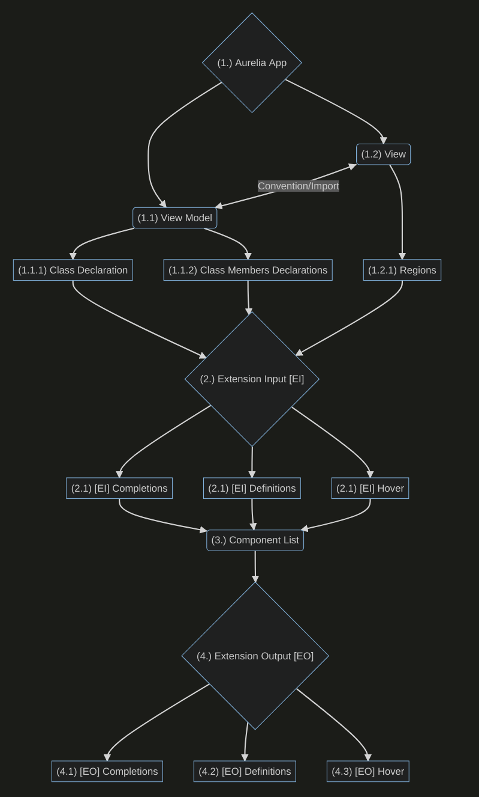
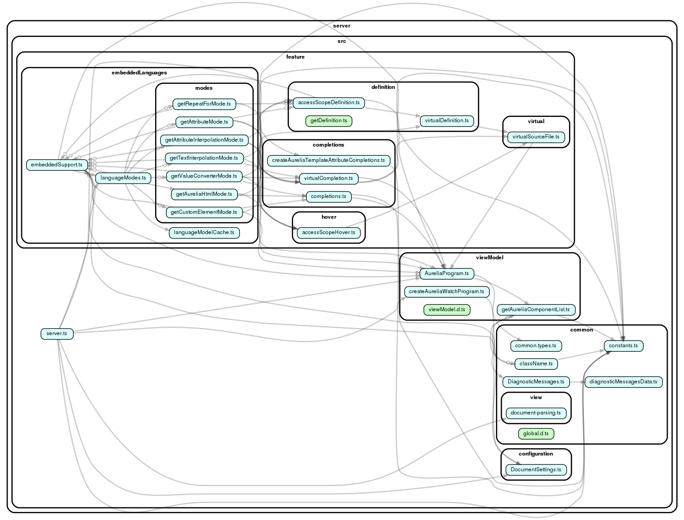

**_NOTE: This document has collapsed regions._**

---

Quick Navigation:

- [Architecture](#architecture)
  - ...
  - [5. Architecture.png](#5-architecturepng)
- [Parsing](#parsing)

Table of contents (expand)

- [Architecture](#architecture)
  - [1. Aurelia App](#1-aurelia-app)
    - [1.1 View Model](#11-view-model)
      - [1.1.1 Class Declaration](#111-class-declaration)
        - [1.1.1.1 Custom Element](#1111-custom-element)
        - [1.1.1.2 Value Converter](#1112-value-converter)
        - [1.1.1.3 Custom Attribute (TODO)](#1113-custom-attribute-todo)
        - [1.1.1.4 Binding Behavior (TODO)](#1114-binding-behavior-todo)
      - [1.1.2 Class Members Declarations](#112-class-members-declarations)
        - [1.1.2.1 Bindables](#1121-bindables)
    - [1.2 View](#12-view)
      - [1.2.1 Regions](#121-regions)
        - [1.2.1.1 Attribute](#1211-attribute)
        - [1.2.1.2 Attribute Interpolation](#1212-attribute-interpolation)
        - [1.2.1.3 Html](#1213-html)
        - [1.2.1.4 Repeat For](#1214-repeat-for)
        - [1.2.1.5 Text Interpolation](#1215-text-interpolation)
        - [1.2.1.6 Custom Element](#1216-custom-element)
        - [1.2.1.7 Value Converter](#1217-value-converter)
        - [1.2.1.8 Binding Behavior (TODO)](#1218-binding-behavior-todo)
  - [2. Extension Input (EI)](#2-extension-input-ei)
    - [2.1 EI - Completions](#21-ei---completions)
    - [2.2 EI - Definitions](#22-ei---definitions)
    - [2.3 EI - Hover](#23-ei---hover)
  - [3 Component List](#3-component-list)
  - [4. Extension Output (EO)](#4-extension-output-eo)
    - [4.1 EO - Completions](#41-eo---completions)
    - [4.2 EO - Definitions](#42-eo---definitions)
    - [4.3 EO - Hover](#43-eo---hover)
  - [5. Architecture.png](#5-architecturepng)
- [Parsing](#parsing)

---

# Architecture

## 1. Aurelia App
*Code Tour present*

### 1.1 View Model
*Code Tour present*

#### 1.1.1 Class Declaration

##### 1.1.1.1 Custom Element
*Code Tour present*
##### 1.1.1.2 Value Converter
##### 1.1.1.3 Custom Attribute (TODO)
##### 1.1.1.4 Binding Behavior (TODO)

#### 1.1.2 Class Members Declarations
*Code Tour present*
##### 1.1.2.1 Bindables
*Code Tour present*

### 1.2 View
*Code Tour present*

#### 1.2.1 Regions
*Code Tour present*
##### 1.2.1.1 Attribute
##### 1.2.1.2 Attribute Interpolation
##### 1.2.1.3 Html
##### 1.2.1.4 Repeat For
##### 1.2.1.5 Text Interpolation
##### 1.2.1.6 Custom Element
##### 1.2.1.7 Value Converter
##### 1.2.1.8 Binding Behavior (TODO)

## 2. Extension Input (EI)
### 2.1 EI - Completions

### 2.2 EI - Definitions
*Code Tour present*

### 2.3 EI - Hover

## 3 Component List
*Code Tour present*

## 4. Extension Output (EO)

### 4.1 EO - Completions

### 4.2 EO - Definitions
*Code Tour present*

### 4.3 EO - Hover

## 5. Architecture.png

Architecture.png (expand)

### Dependency graph

Dependency.png (expand)

_Generated via [dependency-cruiser](https://github.com/sverweij/dependency-cruiser)_

---

# Parsing
_Intention: Know where and when parsing is happening_

Parsing mainly happens in [2. Extension Input (EI)](#2-extension-input-ei)
