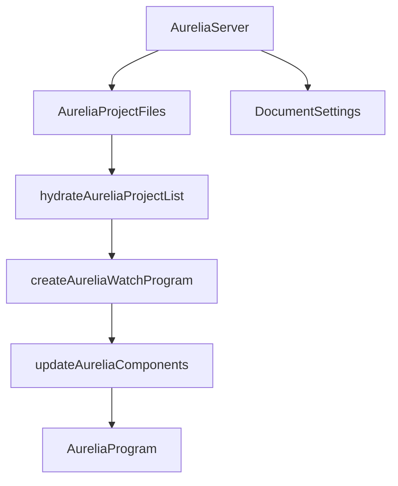
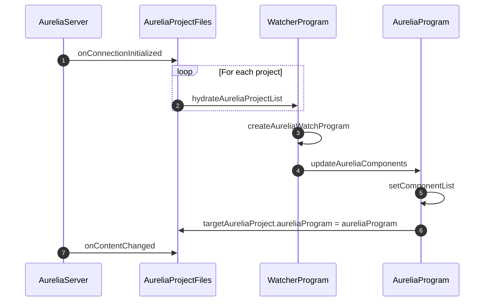

```mermaid
flowchart TD
  AureliaServer --> AureliaProjectFiles
  AureliaServer --> DocumentSettings
  AureliaProjectFiles --> hydrateAureliaProjectList
  hydrateAureliaProjectList --> createAureliaWatchProgram
  createAureliaWatchProgram --> updateAureliaComponents
  updateAureliaComponents --> AureliaProgram

  AureliaServer

  DocumentSettings

  AureliaProjectFiles
  hydrateAureliaProjectList

  AureliaProgram

  createAureliaWatchProgram
  updateAureliaComponents

```

---

```mermaid
sequenceDiagram
    autonumber
    participant AureliaServer
    participant AureliaProjectFiles
    participant WatcherProgram
    participant AureliaProgram

    AureliaServer->>AureliaProjectFiles: onConnectionInitialized

    loop For each project
      AureliaProjectFiles ->> WatcherProgram: hydrateAureliaProjectList
    end
    WatcherProgram ->> WatcherProgram: createAureliaWatchProgram
    WatcherProgram ->> AureliaProgram: updateAureliaComponents
    AureliaProgram ->> AureliaProgram: setComponentList
    AureliaProgram ->> AureliaProjectFiles: targetAureliaProject.aureliaProgram = aureliaProgram

    AureliaServer->>AureliaProjectFiles: onContentChanged
```