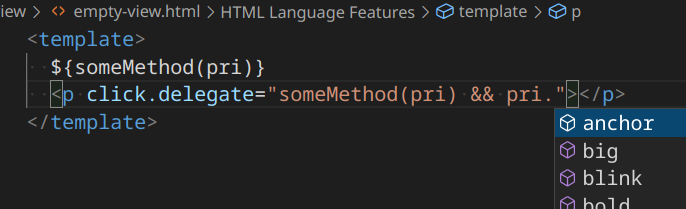

# List of features
*Quick Links: --- [Features table](#features-table) --- [Screenshots](#screenshots) ---*

*⚠️ [Unstable warning](#unstable-warning)*

In this directory, you can find more information on some of the bigger features.
The individual links have the following structure:
- General information
- How to trigger
- Feature list
- Limitations
- Development information

Happy exploring!

## Features table
*(Legend below)*
| Feature/Region     | A/AI/TI | BA  | BB  | CA  | CE  | HTML | I/R | RF  | Signal | VC  |
| ------------------ | ------- | --- | --- | --- | --- | ---- | --- | --- | ------ | --- |
| Code Action        | ➖       | ➖   | ➖   | ➖   | ➖   | ➕    | ➖   | ➖   | ➖      | ➖   |
| Completion         | ➕       | ➕   | ➖   | ➖   | ➕   | ➕    | ➕   | ➕   | ➖      | ➕   |
| Definition         | ➕       | ➕   | ➖   | ➖   | ➕   | ➕    | ➕   | ➕*  | ➖      | ➕   |
| Diagnostics        | ➖       | ➖   | ➖   | ➖   | ➖   | ➕    | ➖   | ➖   | ➖      | ➖   |
| Hover              | ➖       | ➖   | ➖   | ➖   | ➖   | ➕    | ➖   | ➖   | ➖      | ➖   |
| Rename             | ➕       | ➕   | ➖   | ➖   | ➕   | ➕    | ➖   | ➕*  | ➖      | ➖   |
| (Document) Symbol  | ➕       | ➕   | ➖   | ➖   | ➕   | ➕    | ➕   | ➕   | ➖      | ➕   |
| (Workspace) Symbol | ➕       | ➕   | ➖   | ➖   | ➕   | ➕    | ➕   | ➕   | ➖      | ➕   |

*Missing*: Router, Promise, `<let>`

### Legend

➕ : Supported  ➕* : Partially (or unsable) supported  ➖ : Not supported
|                            |                     |                       |
| -------------------------- | ------------------- | --------------------- |
| A: Attribute               | CA: CustomAttribute | RF: RepeatFor         |
| AI: AttributeInterpolation | CE: CustomElement   | TI: TextInterpolation |
| BA: BindableAttribute      | HTML: HTML          | VC: ValueConverter    |
| BB: BindingBehavior        | I/R: Import/Require |                       |

## Screenshots
*(Completions: Provide method completions for Javascript String)*

*(Completions: Provide method completions for Javascript String, in a more complex setup)*
*Limitation: You won't get completions if you type in the middle of the string, eg `some(pri.|) && pri`*. Check out the [Completions doc](../user/completions.readme.md) for an explanation (has to do with Expression parsing).

*(Completions: Object properties completions)*

*(Defintions: Show all places where `<custom-element>` component is used)*

*(Symbols: Search for all Aurelia related information from your Views.)*

## Unstable warning
Please note, that due to the low iteration count, all features may not be as stable as we like them to be. Before submitting and issue, check out the [General issues](#general-issues), [Troubleshooting](#troubleshooting) and [FAQ] section.
If you still haven't found a solution to your problem, you are more than welcome to [open an issue](https://github.com/aurelia/vscode-extension/issues/new).
The extension is in active use by the authors, so you can expect a swift response, but do note, that an actual fix cannot be guaranteed. Regardless, we are thankful, that you took the time to troubleshoot with us!

